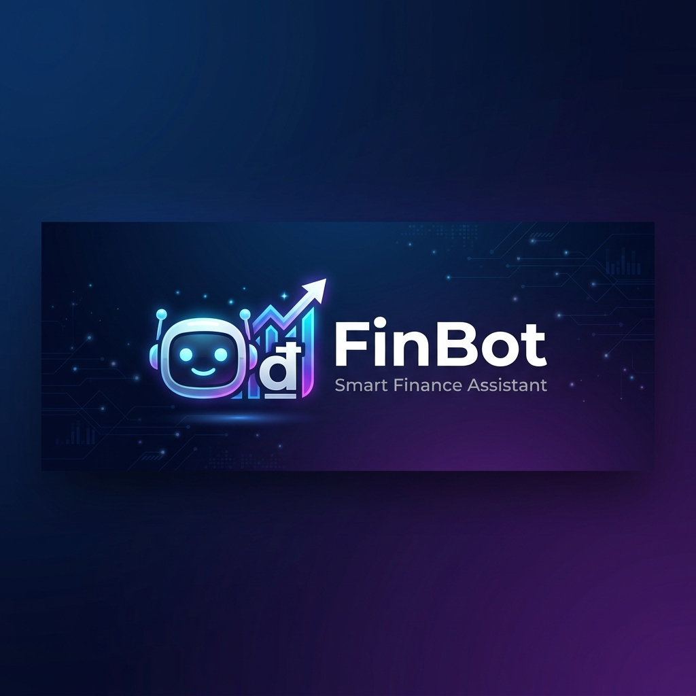

<p align="center">
  
</p>

<p align="center">
  <b>🤖 Trợ lý quản lý tài chính cá nhân thông minh trên Telegram</b>
</p>

<p align="center">
  <a href="#tính-năng">Tính năng</a> •
  <a href="#cài-đặt">Cài đặt</a> •
  <a href="#sử-dụng">Sử dụng</a> •
  <a href="#triển-khai-docker">Docker</a> •
  <a href="#kiến-trúc">Kiến trúc</a>
</p>

<p align="center">
  
  
  
  
  
</p>

---

## ✨ Tại sao dùng FinBot?

Bạn muốn quản lý chi tiêu nhưng **lười mở app**, **lười nhập liệu**? FinBot giải quyết điều đó.

Chỉ cần gửi tin nhắn **bằng ngôn ngữ tự nhiên** trên Telegram:

```
ăn phở 50k
grab 35000 ck
+15tr lương
cafe 29k visa hôm qua
```

FinBot tự hiểu số tiền, phân loại danh mục, và ghi nhận giao dịch. **Không form, không nút bấm, không rào cản.**

---

## 🚀 Tính năng

### 🗣️ Ghi chép bằng ngôn ngữ tự nhiên
- Nhận diện thông minh: `50k`, `2tr5`, `$25`, `500.000`
- Tự động phân loại qua keyword + AI fallback
- Hỗ trợ phương thức thanh toán: `tiền mặt`, `ck`, `visa`, `momo`
- Parse ngày: `hôm qua`, `hôm nay`

### 📊 Báo cáo & Phân tích
- `/today` `/week` `/month` — Xem nhanh chi tiêu
- `/report` — Báo cáo chi tiết + biểu đồ (Pie, Bar, Trend)
- `/budget` — Theo dõi ngân sách theo quy tắc 50/30/20

### 🤖 AI-Powered (Groq / Gemini — Miễn phí)
- Phân loại giao dịch thông minh khi keyword không đủ
- Phân tích xu hướng chi tiêu hàng tháng
- `/advice` — Tư vấn tài chính cá nhân hóa

### 💰 Quản lý tài chính
- Ngân sách theo quy tắc **50/30/20** (Nhu cầu / Mong muốn / Tiết kiệm)
- 24 danh mục mặc định, tự phân loại
- Mục tiêu tiết kiệm (`/goal`)
- Tỷ giá USD/VND **realtime** (tự cập nhật mỗi 6h)

### 🛡️ Nhẹ & Bảo mật
- **SQLite** — Không cần server database
- **Single-user** — Dữ liệu 100% riêng tư
- **Docker ready** — Deploy 1 lệnh
- Dùng Telegram ID làm xác thực, không lưu mật khẩu

---

## 📋 Lệnh Bot

| Lệnh | Mô tả |
|-------|--------|
| `/start` | Onboarding / Dashboard |
| `/today` | Chi tiêu hôm nay |
| `/week` | Chi tiêu tuần này |
| `/month` | Chi tiêu tháng này |
| `/budget` | Theo dõi ngân sách 50/30/20 |
| `/report` | Báo cáo tháng + biểu đồ + AI insights |
| `/advice <câu hỏi>` | Tư vấn tài chính bằng AI |
| `/goal` | Quản lý mục tiêu tiết kiệm |
| `/history` | 10 giao dịch gần nhất |
| `/undo` | Xóa giao dịch cuối cùng |
| `/settings` | Xem/sửa cài đặt |
| `/help` | Hướng dẫn sử dụng |

---

## 🛠️ Cài đặt

### Yêu cầu
- Python 3.12+
- Token Telegram Bot (từ [@BotFather](https://t.me/BotFather))
- (Tùy chọn) API key AI:
  - **Groq** ✅ khuyên dùng — [console.groq.com](https://console.groq.com)
  - Gemini — [aistudio.google.com/apikey](https://aistudio.google.com/apikey)

### Cài đặt nhanh

```bash
# Clone
git clone https://github.com/d4kw1n/finbot-telegram.git
cd finbot-telegram

# Tạo virtual environment
python -m venv .venv
source .venv/bin/activate  # Linux/Mac
# .venv\Scripts\activate   # Windows

# Cài dependencies
pip install -r requirements.txt

# Cấu hình
cp .env.example .env
# Sửa .env → thêm BOT_TOKEN và API key AI

# Chạy
python run.py
```

---

## 🐳 Triển khai Docker

```bash
# Build & chạy
docker compose up -d --build

# Xem logs
docker logs -f finbot

# Dừng
docker compose down
```

<details>
<summary>⚙️ Cấu hình nâng cao Docker</summary>

Nếu container không kết nối được Telegram API, thêm vào `docker-compose.yml`:
```yaml
network_mode: host
```

Hoặc cấu hình proxy trong `.env`:
```bash
PROXY_URL=socks5://127.0.0.1:1080
```
</details>

---

## ⚙️ Biến môi trường

| Biến | Bắt buộc | Mô tả |
|------|----------|--------|
| `BOT_TOKEN` | ✅ | Token từ @BotFather |
| `GROQ_API_KEY` | 🔸 | Key Groq (khuyên dùng cho AI) |
| `GEMINI_API_KEY` | 🔸 | Key Gemini (backup cho AI) |
| `DB_PATH` | ❌ | Đường dẫn SQLite (mặc định: `data/finance.db`) |
| `PROXY_URL` | ❌ | Proxy cho network bị chặn |
| `CONNECT_TIMEOUT` | ❌ | Timeout kết nối (mặc định: 30s) |

> 🔸 Chỉ cần 1 trong 2 API key AI. Bot vẫn hoạt động không có AI, chỉ mất tính năng phân loại thông minh và tư vấn.

---

## 🏗️ Kiến trúc

```
finbot-telegram/
├── run.py                          # Entry point
├── Dockerfile                      # Multi-stage Docker build
├── docker-compose.yml              # Container orchestration
├── requirements.txt                # Dependencies
└── src/
    ├── config.py                   # Cấu hình (đọc từ .env)
    ├── database.py                 # SQLite async (aiosqlite)
    ├── parsers/
    │   ├── amount_parser.py        # Parse "50k", "2tr5", "$25"
    │   └── nlp_parser.py           # NLP message → transaction
    ├── services/
    │   ├── ai_service.py           # Groq / Gemini (multi-provider)
    │   ├── chart_service.py        # Matplotlib dark-theme charts
    │   └── currency_service.py     # Live USD/VND exchange rate
    ├── utils/
    │   ├── constants.py            # 24 categories, keywords
    │   └── formatter.py            # Tiền tệ, progress bar
    └── bot/
        ├── app.py                  # Handler assembly
        ├── keyboards/inline.py     # Inline keyboard builders
        └── handlers/
            ├── start.py            # Onboarding + Dashboard
            ├── transaction.py      # NLP input + CRUD
            ├── budget.py           # Ngân sách 50/30/20
            ├── report.py           # Báo cáo + biểu đồ + AI
            ├── goal.py             # Mục tiêu tiết kiệm
            ├── settings.py         # Cài đặt
            └── help.py             # Hướng dẫn
```

---

## 🔧 Tech Stack

| Thành phần | Công nghệ |
|------------|-----------|
| Ngôn ngữ | Python 3.12+ |
| Bot Framework | python-telegram-bot v21 |
| Database | SQLite (aiosqlite) |
| AI | Groq (Llama 3.3 70B) / Google Gemini 2.0 Flash |
| Biểu đồ | Matplotlib (dark theme) |
| Tỷ giá | Live API (open.er-api.com) |
| Container | Docker + Docker Compose |

---

## 📄 License

MIT License — Tự do sử dụng và chỉnh sửa.

---

<p align="center">
  Made with ❤️ by <a href="https://github.com/d4kw1n">d4kw1n</a>
</p>
